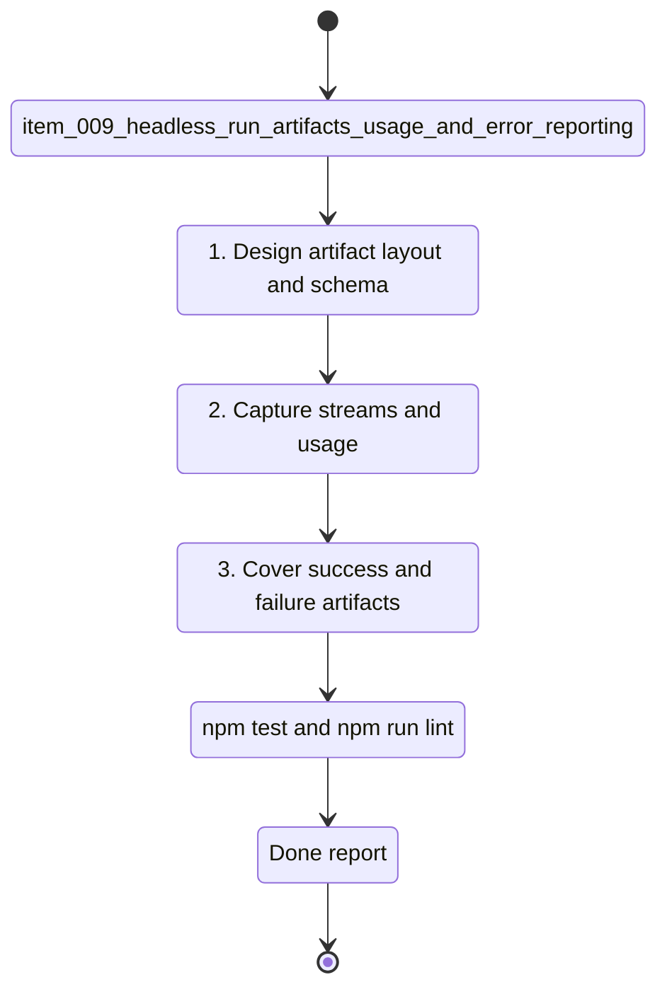

## task_009_headless_run_artifacts_usage_and_error_reporting - Headless run artifacts usage and error reporting
> From version: 0.6.5
> Schema version: 1.0
> Status: Ready
> Understanding: 88
> Confidence: 78
> Progress: 0
> Complexity: High
> Theme: Integration
> Reminder: Update status/understanding/confidence/progress and linked request/backlog references when you edit this doc.

# Context
- Derived from backlog item `item_009_headless_run_artifacts_usage_and_error_reporting`.
- Source file: `logics/backlog/item_009_headless_run_artifacts_usage_and_error_reporting.md`.
- Related request(s): `req_000_orchestia_headless_json_task_runner`.
- Orchestia needs transcript/stdout/stderr artifacts, normalized usage fields, and stable error source reporting for every headless run.

# Plan
- [ ] 1. Define artifact layout and naming for headless run transcript, stdout, and stderr files.
- [ ] 2. Ensure `cdx run --json` returns absolute artifact paths whenever files exist.
- [ ] 3. Capture provider stdout/stderr to files while keeping stdout reserved for final JSON.
- [ ] 4. Normalize usage fields as `input_tokens`, `output_tokens`, `reasoning_tokens`, and `total_tokens`, using `null` when unavailable.
- [ ] 5. Include artifact paths and usage fields on both success and failure responses.
- [ ] 6. Standardize `error.source`, `error.code`, `error.message`, and provider-specific details where available.
- [ ] 7. Add tests for success artifacts, cdx validation failure, provider failure, unknown usage, JSON-only stdout, and absolute paths.
- [ ] 8. Document remaining retention/cleanup decision and update linked Logics docs.
- [ ] CHECKPOINT: leave the current wave commit-ready and update linked Logics docs before continuing.
- [ ] GATE: do not close the task until relevant tests and lint pass.

# Validation
- `npm run lint`
- `npm test`
- Focused tests for artifact creation and JSON response paths.
- Focused tests for unknown usage and cdx/provider error source distinction.

# AC Traceability
- AC1 -> Plan: success artifact paths.
- AC2 -> Plan: failure artifact paths.
- AC3 -> Plan: JSON-only stdout.
- AC4 -> Plan: normalized usage fields.
- AC5 -> Plan: cdx error source.
- AC6 -> Plan: provider error source.
- AC7 -> Plan: regression coverage.

# Decision framing
- Product framing: Consider
- Product signals: Orchestia needs audit and diagnosis artifacts.
- Product follow-up: Document artifact behavior.
- Architecture framing: Required
- Architecture signals: stream capture, transcript storage, usage normalization, error schema.
- Architecture follow-up: Decide retention/cleanup policy.

# Links
- Product brief(s): (none yet)
- Architecture decision(s): (none yet)
- Derived from `item_009_headless_run_artifacts_usage_and_error_reporting`
- Request(s): `req_000_orchestia_headless_json_task_runner`

# AI Context
- Summary: Implement artifact, usage, and error reporting details for headless `cdx run --json`.
- Keywords: transcript_path, stdout_path, stderr_path, usage, tokens, error.source, cdx error, provider error
- Use when: Implementing diagnostics and artifact reporting for headless runs.
- Skip when: Work is only about selector ranking or effort mapping.

# Definition of Done (DoD)
- [ ] Scope implemented and acceptance criteria covered.
- [ ] Validation commands executed and results captured.
- [ ] Linked request/backlog/task docs updated.
- [ ] Status is `Done` and progress is `100%`.

# Report
