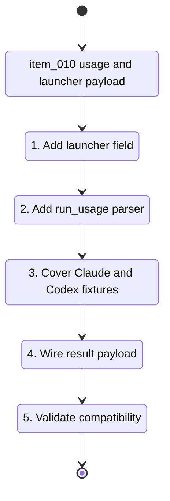

## task_010_implement_cdx_run_usage_extraction_and_launcher_payload - Implement cdx run usage extraction and launcher payload
> From version: 0.7.0
> Schema version: 1.0
> Status: Done
> Understanding: 90
> Confidence: 82
> Progress: 100
> Complexity: Medium
> Theme: Headless automation
> Reminder: Update status/understanding/confidence/progress and linked request/backlog references when you edit this doc.

# Context
- Derived from backlog item `item_010_populate_cdx_run_usage_and_launcher_payload`.
- Related request: `req_001_populate_headless_run_usage_tokens_for_orchestia`.
- This task depends on stable provider artifacts from `item_011_use_provider_native_headless_launch_modes_for_cdx_run` or equivalent verified provider fixtures.
- The goal is additive: identify cdx-manager responses with `launcher: "cdx"` and populate nullable usage fields when trusted provider output exposes token counts.

# Plan
- [x] 1. Add top-level `launcher: "cdx"` to `cdx run --json` result envelopes without removing or renaming existing fields.
- [x] 2. Add a small `run_usage` module that returns the existing all-null usage payload by default.
- [x] 3. Implement provider-aware parsing for verified Claude JSON or JSONL usage shapes, with explicit cumulative-vs-delta fixture expectations.
- [x] 4. Implement provider-aware parsing for verified Codex `exec --json` or JSONL usage shapes only after fixture evidence exists.
- [x] 5. Reject or ignore unknown output shapes and broad human-text token strings by returning all-null usage.
- [x] 6. Wire extracted usage into `_run_result_payload` using the captured stdout artifact path and selected provider.
- [x] 7. Add focused `unittest` coverage for missing files, unknown providers, malformed output, Claude fixtures, Codex fixtures, and all-null fallback.
- [x] 8. Add a CLI-level test that simulates a provider writing usage to stdout and verifies `launcher`, `usage`, artifact paths, and backward-compatible fields in the final cdx JSON.
- [x] 9. Update linked Logics docs with final provider fixture notes and validation evidence.
- [x] CHECKPOINT: leave the wave commit-ready and update linked Logics docs before continuing.
- [x] GATE: do not close a wave or step until the relevant automated tests and quality checks have been run successfully.

# Backlog
- `item_010_populate_cdx_run_usage_and_launcher_payload`

# Definition of Done (DoD)
- [x] Code is implemented and reviewed.
- [x] Validation passes.
- [x] Linked docs are synchronized.

# Validation
- `python -m py_compile bin/cdx src/*.py test/test_*_py.py`
- `python -m unittest discover -s test -p 'test_*_py.py'`
- `npm run lint`
- `npm test`
- `python3 -m logics_manager lint --require-status`

# AC Traceability
- AC1 -> Plan: top-level launcher field.
- AC2 -> Plan: verified provider usage parsing.
- AC3 -> Plan: all-null fallback behavior.
- AC4 -> Plan: Claude fixture coverage.
- AC5 -> Plan: Codex fixture coverage.
- AC6 -> Plan: conservative parser boundaries.
- AC7 -> Plan: unittest and CLI integration coverage.
- AC8 -> Plan: additive payload compatibility.

# Report
- Implemented `src/run_usage.py` with conservative Codex/Claude JSON and JSONL usage extraction, unknown-format null fallback, and no free-text token parsing.
- Added top-level `launcher: "cdx"` to `cdx run --json` result payloads.
- Validation evidence:
  - `python -m unittest discover -s test -p 'test_runtime_py.py'`
  - `python -m unittest discover -s test -p 'test_cli_py.py' -k 'run_'`
  - `npm run lint`

# AI Context
- Summary: Implement the additive `launcher` field and conservative token usage extraction for `cdx run --json`.
- Keywords: run_usage, usage tokens, launcher, cdx run json, Claude JSONL, Codex JSONL, unittest
- Use when: Implementing or reviewing payload-level usage extraction for Orchestia.
- Skip when: The provider-native headless launch modes are still missing or fixture output is unavailable.

# Links
- Request: `req_001_populate_headless_run_usage_tokens_for_orchestia`
- Product brief(s): (none yet)
- Architecture decision(s): (none yet)
