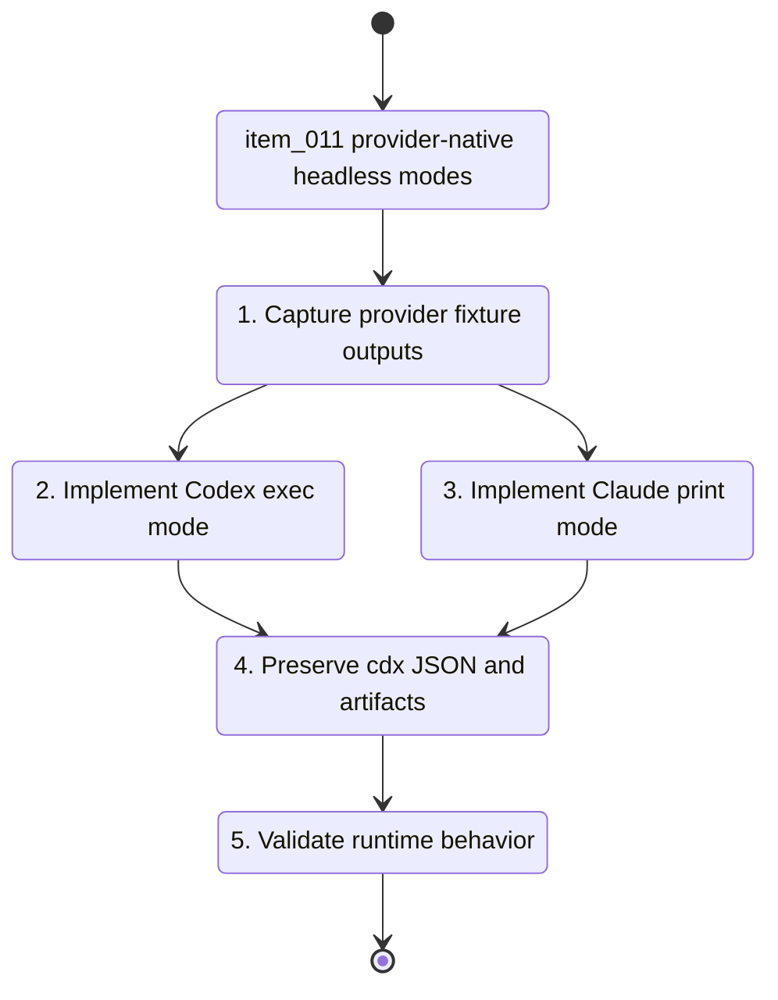

## task_011_implement_provider_native_headless_cdx_run_launch_modes - Implement provider native headless cdx run launch modes
> From version: 0.7.0
> Schema version: 1.0
> Status: Done
> Understanding: 100%
> Confidence: 95%
> Progress: 100%
> Complexity: High
> Theme: Headless automation
> Reminder: Update status/understanding/confidence/progress and linked request/backlog references when you edit this doc.

# Context
- Derived from backlog item `item_011_use_provider_native_headless_launch_modes_for_cdx_run`.
- Related request: `req_001_populate_headless_run_usage_tokens_for_orchestia`.
- Local fixture runs showed that the current `cdx run --json` launch path is not sufficient for reliable Orchestia automation:
  - Codex failed in non-TTY mode with `stdin is not a terminal`;
  - Claude succeeded but emitted plain text only, with no usage metadata.
- The implementation should switch headless provider execution to provider-native non-interactive modes while preserving the cdx JSON contract.

# Plan
- [x] 1. Inspect current Codex and Claude CLI options and capture minimal real fixture outputs for `codex exec --json` and `claude --print --output-format json` or `stream-json`.
- [x] 2. Design a provider-runtime branch for headless runs that is separate from interactive `cdx <session>` launch behavior.
- [x] 3. Implement Codex headless launch using `codex exec --json` or the current verified non-interactive equivalent, preserving `CODEX_HOME`, cwd, model, permission, and reasoning effort mapping.
- [x] 4. Implement Claude headless launch using `claude --print` with a verified JSON or stream-json output mode, preserving isolated auth home, model, permission, and effort mapping.
- [x] 5. Keep cdx stdout reserved for the final cdx JSON payload while provider stdout/stderr continue to write to artifact files.
- [x] 6. Preserve structured error handling for invalid cwd, provider start failure, provider non-zero exit, and timeout.
- [x] 7. Add tests for provider command construction, successful simulated runs, non-zero provider exit, timeout behavior, and artifact capture.
- [x] 8. Update linked Logics docs with final fixture evidence and any provider-mode constraints.
- [x] CHECKPOINT: leave the wave commit-ready and update linked Logics docs before continuing.
- [x] GATE: do not close a wave or step until the relevant automated tests and quality checks have been run successfully.

# Backlog
- `item_011_use_provider_native_headless_launch_modes_for_cdx_run`

# Definition of Done (DoD)
- [x] Code is implemented and reviewed.
- [x] Validation passes.
- [x] Linked docs are synchronized.

# Validation
- `python -m py_compile bin/cdx src/*.py test/test_*_py.py`
- `python -m unittest discover -s test -p 'test_*_py.py'`
- `npm run lint`
- `npm test`
- `python3 -m logics_manager lint --require-status`

# AC Traceability
- AC1 -> Plan: Codex `cdx run --json` non-TTY execution.
- AC2 -> Plan: Claude non-interactive execution.
- AC3 -> Plan: JSON-only cdx stdout and provider artifact capture.
- AC4 -> Plan: stable result envelope.
- AC5 -> Plan: launch setting mapping.
- AC6 -> Plan: timeout and provider-start failure handling.
- AC7 -> Plan: command construction and artifact tests.

# Report
- Implemented a dedicated headless launch spec path in `src/provider_runtime.py`.
- Codex headless runs now use `codex exec --json -C <cwd>` with isolated `CODEX_HOME`, model, sandbox, and reasoning effort mapping.
- Claude headless runs now use `claude --print --output-format json` with isolated auth home, model, permission, and effort mapping.
- Validation evidence:
  - `python -m unittest discover -s test -p 'test_runtime_py.py'`
  - `python -m unittest discover -s test -p 'test_cli_py.py' -k 'run_'`
  - `npm run lint`

# AI Context
- Summary: Implement provider-native non-interactive launch modes for headless `cdx run --json` while preserving cdx artifact capture and final JSON output.
- Keywords: codex exec, claude print, output-format json, headless run, provider_runtime, non-TTY, artifacts
- Use when: Implementing or reviewing the provider-runtime changes required before usage extraction can be reliable.
- Skip when: Work is only about parsing token fields from already stable provider artifacts.

# Links
- Request: `req_001_populate_headless_run_usage_tokens_for_orchestia`
- Product brief(s): `prod_002_headless_automation_contract_for_orchestia`
- Architecture decision(s): `adr_002_provider_native_headless_run_boundary`
