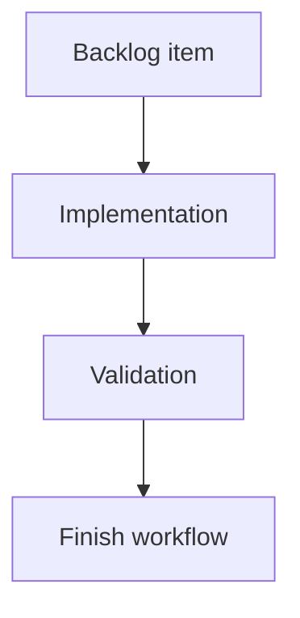

## task_012_support_logics_manager_suggestions_and_update_notices - Support logics-manager suggestions and update notices
> From version: 0.7.6
> Schema version: 1.0
> Status: Done
> Understanding: 100%
> Confidence: 95%
> Progress: 100%
> Complexity: Medium
> Theme: Implementation delivery
> Reminder: Update status/understanding/confidence/progress and linked request/backlog references when you edit this doc.

# Definition of Done (DoD)
- [x] The backlog scope is implemented.
- [x] Acceptance criteria are covered.
- [x] Validation passes.

# Backlog
- `item_012_support_logics_manager_suggestions_and_update_notices`

# Acceptance criteria
- AC1: `cdx` detects `logics-manager` availability and reports it in diagnostics.
- AC2: Assistant launch prompts include Logics usage guidance by default when `logics-manager` is available, and sessions can explicitly disable it.
- AC3: The guidance mentions established and new high-value commands, including viewer/focus workflows, status, health, audit/lint, flow, search/read/list, context-pack, and MCP surfaces.
- AC4: Launch configuration displays and persists the Logics preference alongside RTK.
- AC5: Update warnings can represent multiple tools and include `logics-manager` when a newer version can be checked reliably.
- AC6: RTK update suggestions are considered only when the version source is explicit enough to avoid false positives.

# Validation
- `npm run lint`
- `npm test`
- `python -m unittest discover -s test -p 'test_*_py.py'`
- `python3 -m logics_manager lint --require-status`

# Report
- Implemented in release `0.7.8`.
- Added `--logics on|off` launch settings, default-on Logics guidance when `logics-manager` is available, config/help rendering, companion update notices, provider launch metadata, and RTK preference handling.
- Updated README and release changelog for `0.7.8`.

# AI Context
- Summary: Implement support logics-manager suggestions and update notices.
- Keywords: task, implementation, backlog, runtime, python
- Use when: You need a bounded implementation task for a backlog item.
- Skip when: The work is still at the request or backlog shaping stage.

# Links
- Request: `req_002_support_logics_manager_suggestions_and_update_notices`
- Product brief(s): (none yet)
- Architecture decision(s): `adr_003_logics_and_companion_tool_launch_guidance`

# AC Traceability
- AC1 -> Implementation: health/diagnostic companion metadata. Proof: `src/health.py` and runtime tests.
- AC2 -> Implementation: default-on launch guidance with `--logics off` override. Proof: provider runtime and CLI tests.
- AC3 -> Implementation: launch prompt guidance includes status, health, audit/lint, view, sync, flow, and MCP surfaces. Proof: provider runtime assertions.
- AC4 -> Implementation: launch configuration persists and displays Logics preference with RTK. Proof: `cdx config` and settings tests.
- AC5 -> Implementation: multi-tool update warning payloads include `logics-manager` when checkable. Proof: `test_update_check_py.py`.
- AC6 -> Implementation: RTK update suggestions stay disabled without a reliable source. Proof: update-check tests and release notes.
