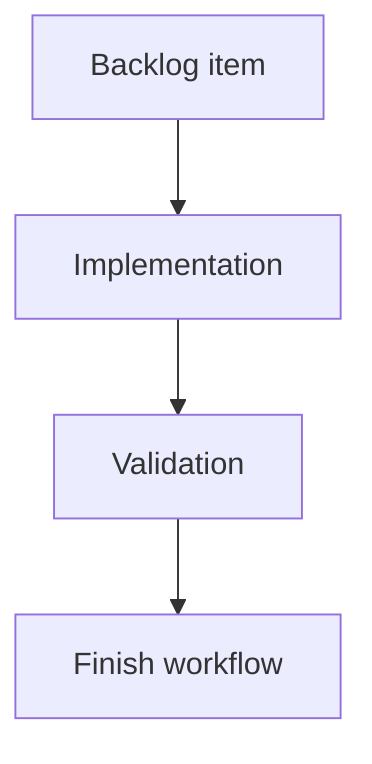

## task_013_release_checksum_governance_gate - Release checksum governance gate
> From version: 0.7.8
> Schema version: 1.0
> Status: Ready
> Understanding: 90%
> Confidence: 85%
> Progress: 0%
> Complexity: Medium
> Theme: Implementation delivery
> Reminder: Update status/understanding/confidence/progress and linked request/backlog references when you edit this doc.

# Definition of Done (DoD)
- [ ] The backlog scope is implemented.
- [ ] Acceptance criteria are covered.
- [ ] Validation passes.

# Backlog
- `item_013_release_checksum_governance_gate`

# Acceptance criteria
- AC1: Release validation fails when the current release version lacks a `vX.Y.Z` entry in `checksums/release-archives.json`.
- AC2: Validation requires both `github_tarball_sha256` and `github_zip_sha256`.
- AC3: npm and PyPI publication workflows run the validation before publishing.
- AC4: Release documentation explains version bump, checksum generation, tag alignment, and publication ordering.
- AC5: README, changelog/release guidance, Logics docs, and helper output references are updated where they describe release validation or publication order.

# AC Traceability
- request-AC1 -> Task AC1/AC2. Proof: implement checksum presence and field validation.
- request-AC2 -> Task AC3. Proof: wire validation into npm and PyPI publish workflows before upload.
- request-AC3 -> Task AC4. Proof: update release workflow documentation.
- request-AC11 -> Validation. Proof: focused tests for checksum validation.
- request-AC12 -> Task AC5. Proof: documentation/help alignment for release validation.

# Validation
- Run `python3 -m logics_manager lint --require-status`.
- Run `python3 -m logics_manager flow finish task task_013_release_checksum_governance_gate.md` after implementation.

# Report
- Implementation complete.

# AI Context
- Summary: Implement release checksum governance gate.
- Keywords: task, implementation, backlog, runtime, python
- Use when: You need a bounded implementation task for a backlog item.
- Skip when: The work is still at the request or backlog shaping stage.

# Links
- Request: `req_004_harden_release_governance_and_add_logics_viewer_command`
- Product brief(s): (none yet)
- Architecture decision(s): (none yet)
