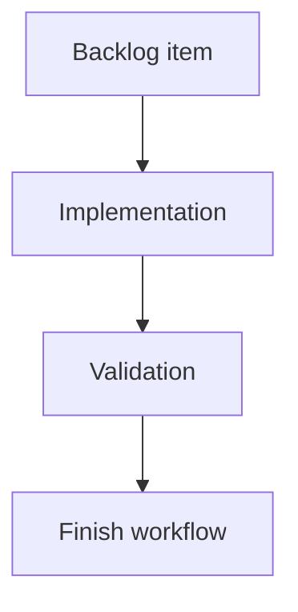

## task_014_version_logics_md_as_project_guidance - Version LOGICS.md as project guidance
> From version: 0.7.8
> Schema version: 1.0
> Status: Ready
> Understanding: 90%
> Confidence: 85%
> Progress: 0%
> Complexity: Medium
> Theme: Implementation delivery
> Reminder: Update status/understanding/confidence/progress and linked request/backlog references when you edit this doc.

# Definition of Done (DoD)
- [ ] The backlog scope is implemented.
- [ ] Acceptance criteria are covered.
- [ ] Validation passes.

# Backlog
- `item_014_version_logics_md_as_project_guidance`

# Acceptance criteria
- AC1: `LOGICS.md` is removed from `.gitignore`.
- AC2: `LOGICS.md` remains tracked in git.
- AC3: Validation fails if `LOGICS.md` is missing.
- AC4: Validation checks for core command families: `status`, `health`, `audit`, `lint`, `view`, `sync`, `flow`, and `mcp`.
- AC5: README, CLI/help references, Logics docs, and release guidance stay aligned with the decision to version `LOGICS.md`.

# AC Traceability
- request-AC4 -> Task AC1/AC2/AC3/AC4. Proof: `.gitignore` cleanup, tracked `LOGICS.md`, and validation guard.
- request-AC11 -> Validation. Proof: focused test for `LOGICS.md` tracking expectations.
- request-AC12 -> Task AC5. Proof: documentation/help alignment for versioned project guidance.

# Validation
- Run `python3 -m logics_manager lint --require-status`.
- Run `python3 -m logics_manager flow finish task task_014_version_logics_md_as_project_guidance.md` after implementation.

# Report
- Implementation complete.

# AI Context
- Summary: Implement version logics.md as project guidance.
- Keywords: task, implementation, backlog, runtime, python
- Use when: You need a bounded implementation task for a backlog item.
- Skip when: The work is still at the request or backlog shaping stage.

# Links
- Request: `req_004_harden_release_governance_and_add_logics_viewer_command`
- Product brief(s): (none yet)
- Architecture decision(s): (none yet)
