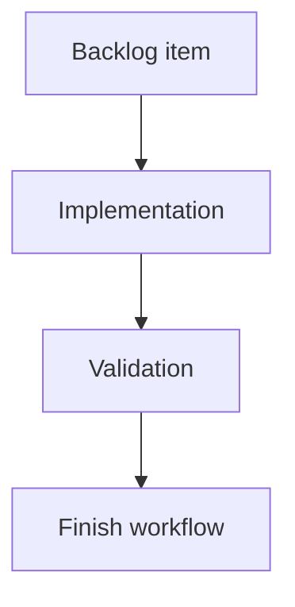

## task_015_add_cdx_view_logics_viewer_delegation - Add cdx view Logics viewer delegation
> From version: 0.7.8
> Schema version: 1.0
> Status: Done
> Understanding: 100%
> Confidence: 95%
> Progress: 100%
> Complexity: Medium
> Theme: Implementation delivery
> Reminder: Update status/understanding/confidence/progress and linked request/backlog references when you edit this doc.

# Definition of Done (DoD)
- [x] The backlog scope is implemented.
- [x] Acceptance criteria are covered.
- [x] Validation passes.

# Backlog
- `item_015_add_cdx_view_logics_viewer_delegation`

# Acceptance criteria
- AC1: `cdx view` delegates to `logics-manager view` from the caller's current working directory.
- AC2: Missing `logics-manager` produces a clear actionable error.
- AC3: `cdx view --json` returns structured availability, command, update, and failure details without opening the viewer.
- AC4: A reliable newer `logics-manager` version produces a non-blocking update suggestion.
- AC5: README and CLI help document `cdx view`.
- AC6: Tests cover delegation, missing tool behavior, JSON mode, and update suggestion behavior.
- AC7: Changelog/release guidance, Logics docs, and helper output examples are updated for `cdx view` where applicable.

# AC Traceability
- request-AC7 -> Task AC1/AC5. Proof: `cdx view` delegation and docs.
- request-AC8 -> Task AC2. Proof: missing-tool error path.
- request-AC9 -> Task AC4. Proof: companion update suggestion.
- request-AC10 -> Task AC3. Proof: JSON diagnostic mode.
- request-AC11 -> Task AC6. Proof: focused `cdx view` tests.
- request-AC12 -> Task AC5/AC7. Proof: README/help/changelog/Logics/helper documentation alignment for `cdx view`.

# Validation
- `node bin/python-runner.js -m unittest discover -s test -p test_cli_py.py -k view`
- `npm run lint`
- `logics-manager lint --require-status`
- `logics-manager audit`

# Report
- Added `cdx view` command routing and CLI help as a thin wrapper around `logics-manager view`.
- Added JSON diagnostics for viewer availability, command/cwd, update notices, and missing-tool failure details without opening the viewer.
- Updated README, changelog, and Logics guidance for the new viewer shortcut.

# AI Context
- Summary: Implement add cdx view logics viewer delegation.
- Keywords: task, implementation, backlog, runtime, python
- Use when: You need a bounded implementation task for a backlog item.
- Skip when: The work is still at the request or backlog shaping stage.

# Links
- Request: `req_004_harden_release_governance_and_add_logics_viewer_command`
- Product brief(s): (none yet)
- Architecture decision(s): (none yet)
