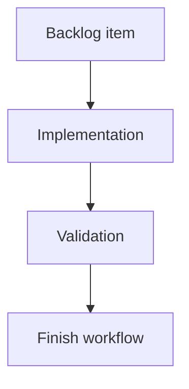

## task_016_modularize_cli_command_domains - Modularize CLI command domains
> From version: 0.7.8
> Schema version: 1.0
> Status: Done
> Understanding: 100%
> Confidence: 95%
> Progress: 100%
> Complexity: Medium
> Theme: Implementation delivery
> Reminder: Update status/understanding/confidence/progress and linked request/backlog references when you edit this doc.

# Definition of Done (DoD)
- [x] The backlog scope is implemented.
- [x] Acceptance criteria are covered.
- [x] Validation passes.

# Backlog
- `item_016_modularize_cli_command_domains`

# Acceptance criteria
- AC1: One command domain is extracted from `src/cli_commands.py` into a smaller module.
- AC2: Existing CLI behavior and JSON contracts for that domain are preserved.
- AC3: Handler routing remains easy to audit from `src/cli.py` / `src/cli_commands.py`.
- AC4: Focused tests cover the moved domain after extraction.
- AC5: `npm run lint` and `npm test` pass after the extraction.
- AC6: README, CLI help, helper output examples, changelog/release guidance, and Logics docs remain aligned for the moved command domain.

# AC Traceability
- request-AC5 -> Task AC1/AC2. Proof: one command-domain extraction while preserving behavior.
- request-AC6 -> Task AC3/AC4. Proof: auditable routing and focused moved-domain tests.
- request-AC11 -> Task AC4/AC5. Proof: modularization regression tests and full validation.
- request-AC12 -> Task AC6. Proof: documentation/help alignment for the moved command domain.

# Validation
- `node bin/python-runner.js -m unittest discover -s test -p test_cli_py.py -k view`
- `npm run lint`
- `npm test`
- `logics-manager lint --require-status`
- `logics-manager audit`

# Report
- Extracted the `cdx view` command handler from `src/cli_commands.py` into `src/cli_view.py`.
- Kept `src/cli_commands.py` as the compatibility facade by re-exporting `handle_view`, so existing routing from `src/cli.py` remains easy to audit.
- Preserved the focused `cdx view` tests for delegation, missing-tool behavior, JSON diagnostics, and update suggestions.

# AI Context
- Summary: Implement modularize cli command domains.
- Keywords: task, implementation, backlog, runtime, python
- Use when: You need a bounded implementation task for a backlog item.
- Skip when: The work is still at the request or backlog shaping stage.

# Links
- Request: `req_004_harden_release_governance_and_add_logics_viewer_command`
- Product brief(s): (none yet)
- Architecture decision(s): (none yet)
