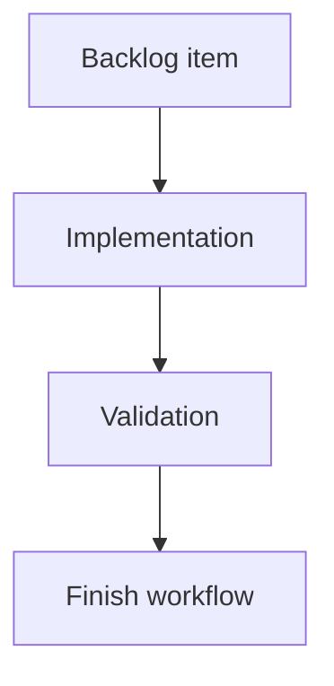

## task_017_add_observable_assistant_run_registry_and_structured_task_reports - Add observable assistant run registry and structured task reports
> From version: 0.8.0
> Schema version: 1.0
> Status: Done
> Understanding: 90%
> Confidence: 85%
> Progress: 100%
> Complexity: Medium
> Theme: Implementation delivery
> Reminder: Update status/understanding/confidence/progress and linked request/backlog references when you edit this doc.

# Definition of Done (DoD)
- [x] The backlog scope is implemented.
- [x] Acceptance criteria are covered.
- [x] Validation passes.

# Backlog
- `item_017_add_observable_assistant_run_registry_and_structured_task_reports`

# Acceptance criteria
- AC1: Headless runs are persisted before provider execution starts with a stable `run_id`, `status: running`, session/provider metadata, cwd, timestamps, and artifact paths.
- AC2: Headless runs transition to a terminal status on success, provider failure, timeout, cancellation, or detected stale process.
- AC3: A caller can list recent runs and fetch a single run status as JSON without parsing transcripts or launch history text.
- AC4: A caller can fetch a completed run report as JSON, including final result metadata, usage, errors, artifact paths, and any structured task output.
- AC5: Existing `cdx run --json` consumers remain compatible and still receive exactly one final JSON object on stdout.
- AC6: A first `code-review` run kind can produce a structured report with findings, severities, file/line references when available, summary, and recommended next steps.
- AC7: The code-review report shape is documented and stable enough for Logics to consume and offer report-to-workflow actions.
- AC8: Tests cover run lifecycle persistence, stale PID cleanup, status/report CLI JSON output, final payload compatibility, and code-review report parsing or fallback behavior.

# Validation
- Run `python3 -m logics_manager lint --require-status`.
- Run `python3 -m logics_manager flow finish task task_017_add_observable_assistant_run_registry_and_structured_task_reports.md` after implementation.
- Finish workflow executed on 2026-06-11.
- Linked backlog/request close verification passed.

# Report
- Implementation complete.
- Finished on 2026-06-11.
- Linked backlog item(s): `item_017_add_observable_assistant_run_registry_and_structured_task_reports`
- Related request(s): `req_005_add_observable_assistant_run_registry_and_structured_task_reports`

# AI Context
- Summary: Implement add observable assistant run registry and structured task reports.
- Keywords: task, implementation, backlog, runtime, python
- Use when: You need a bounded implementation task for a backlog item.
- Skip when: The work is still at the request or backlog shaping stage.

# Links
- Request: `req_005_add_observable_assistant_run_registry_and_structured_task_reports`
- Product brief(s): (none yet)
- Architecture decision(s): (none yet)
