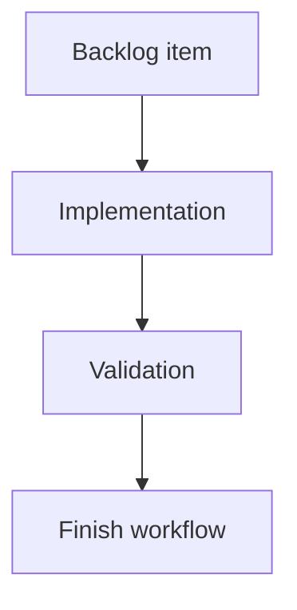

## task_018_harden_codex_multi_account_authentication_isolation - Harden Codex multi-account authentication isolation
> From version: 0.9.2
> Schema version: 1.0
> Status: Done
> Understanding: 90%
> Confidence: 85%
> Progress: 100%
> Complexity: Medium
> Theme: Implementation delivery
> Reminder: Update status/understanding/confidence/progress and linked request/backlog references when you edit this doc.

# Definition of Done (DoD)
- [x] The backlog scope is implemented.
- [x] Acceptance criteria are covered.
- [x] Validation passes.

# Backlog
- `item_019_harden_codex_multi_account_authentication_isolation`

# Acceptance criteria
- AC1: `cdx login <codex-session>` no longer performs an unconditional `codex logout` first, or the logout behavior becomes explicitly opt-in with clear documentation and tests.
- AC2: Reauthenticating one Codex session does not modify another session's isolated `auth.json`, session root, launch settings, or auth state.
- AC3: Session creation either makes global `~/.codex/auth.json` seeding explicit/diagnosable or provides a safer flow for users who need two different Codex accounts.
- AC4: A live Codex auth probe path is available and used by `cdx status --refresh`, `cdx doctor`, or a dedicated diagnostic command to compare local token presence against `codex login status` for each session.
- AC5: Launch authentication checks do not rely solely on token presence when the session is known or suspected stale; stale or invalid tokens produce an actionable "run cdx login <name>" result.
- AC6: Diagnostics report per-session Codex `authHome`, whether `auth.json` exists, decoded non-secret account identity/email when available, and live login status, without printing raw tokens.
- AC7: Tests cover two Codex sessions with distinct isolated auth homes and assert that login/logout/status/refresh operations for one session do not touch the other.
- AC8: Tests cover stale-token behavior where `auth.json` contains tokens but `codex login status` reports "Not logged in".
- AC9: README troubleshooting documents the multi-account auth model, the global-auth seeding caveat, and the safe procedure to create or repair two Codex account sessions.

# Validation
- Run `python3 -m logics_manager lint --require-status`.
- Run `python3 -m logics_manager flow finish task task_018_harden_codex_multi_account_authentication_isolation.md` after implementation.
- Implemented Codex multi-account auth hardening: removed implicit pre-login logout, added live auth probing for login/launch, added doctor diagnostics for per-session authHome/local token/live status without raw tokens, documented multi-account repair flow, and validated with npm run lint, npm test, and logics-manager lint --require-status.
- Finish workflow executed on 2026-06-18.
- Linked backlog/request close verification passed.

# Report
- Implementation complete.
- Finished on 2026-06-18.
- Linked backlog item(s): `item_019_harden_codex_multi_account_authentication_isolation`
- Related request(s): `req_007_harden_codex_multi_account_auth_isolation`

# AI Context
- Summary: Implement harden codex multi-account authentication isolation.
- Keywords: task, implementation, backlog, runtime, python
- Use when: You need a bounded implementation task for a backlog item.
- Skip when: The work is still at the request or backlog shaping stage.

# Links
- Request: `req_007_harden_codex_multi_account_auth_isolation`
- Product brief(s): (none yet)
- Architecture decision(s): (none yet)

# AC Traceability
- request-AC1 -> This task. Proof: Planned implementation evidence: `cdx login <codex-session>` no longer performs an unconditional `codex logout` first, or the logout behavior becomes explicitly opt-in with clear documentation and tests.
- request-AC2 -> This task. Proof: Planned implementation evidence: Reauthenticating one Codex session does not modify another session's isolated `auth.json`, session root, launch settings, or auth state.
- request-AC3 -> This task. Proof: Planned implementation evidence: Session creation either makes global `~/.codex/auth.json` seeding explicit/diagnosable or provides a safer flow for users who need two different Codex accounts.
- request-AC4 -> This task. Proof: Planned implementation evidence: A live Codex auth probe path is available and used by `cdx status --refresh`, `cdx doctor`, or a dedicated diagnostic command to compare local token presence against `codex login status` for each session.
- request-AC5 -> This task. Proof: Planned implementation evidence: Launch authentication checks do not rely solely on token presence when the session is known or suspected stale; stale or invalid tokens produce an actionable "run cdx login <name>" result.
- request-AC6 -> This task. Proof: Planned implementation evidence: Diagnostics report per-session Codex `authHome`, whether `auth.json` exists, decoded non-secret account identity/email when available, and live login status, without printing raw tokens.
- request-AC7 -> This task. Proof: Planned implementation evidence: Tests cover two Codex sessions with distinct isolated auth homes and assert that login/logout/status/refresh operations for one session do not touch the other.
- request-AC8 -> This task. Proof: Planned implementation evidence: Tests cover stale-token behavior where `auth.json` contains tokens but `codex login status` reports "Not logged in".
- request-AC9 -> This task. Proof: Planned implementation evidence: README troubleshooting documents the multi-account auth model, the global-auth seeding caveat, and the safe procedure to create or repair two Codex account sessions.
