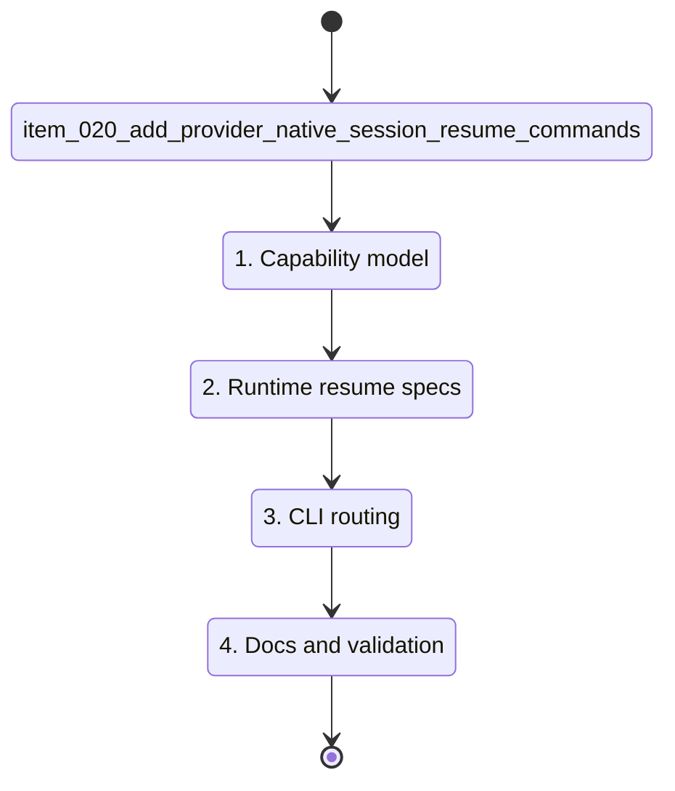

## task_019_add_provider_native_session_resume_commands - Add provider-native session resume commands
> From version: 0.9.3
> Schema version: 1.0
> Status: Done
> Understanding: 95%
> Confidence: 90%
> Progress: 100%
> Complexity: Medium
> Theme: Provider workflow
> Reminder: Update status/understanding/confidence/progress and linked request/backlog references when you edit this doc.

# Context
- Derived from backlog item `item_020_add_provider_native_session_resume_commands`.
- Source file: `logics/backlog/item_020_add_provider_native_session_resume_commands.md`.
- Codex supports `codex resume [SESSION_ID] [PROMPT]` and `codex resume --last`.
- Claude supports `claude --continue` for the most recent conversation in the current directory and `claude --resume [value]` for an explicit conversation value or picker/search flow.
- The first delivery should prefer deterministic named-session scoping over provider pickers.

# Plan
- [x] 1. Add a provider-neutral resume capability helper that returns `resumable`, `provider`, `strategy`, `reason`, and a redacted provider command preview for a session.
- [x] 2. Add provider runtime support for an interactive `resume` action distinct from normal `launch`.
- [x] 3. Implement Codex resume spec as `codex resume --last` under the session's isolated `CODEX_HOME`, preserving cwd with `--cd` and compatible launch settings.
- [x] 4. Implement Claude resume spec as `claude --continue` under the session's isolated `HOME`, preserving cwd through process options and compatible launch settings.
- [x] 5. Add CLI parsing for `cdx <name> -r`, `cdx <name> --resume`, `cdx resume <name> [--json]`, and `cdx can-resume <name> [--json]`.
- [x] 6. Ensure unsupported providers report `not_supported` from capability checks and fail resume launch without starting a normal launch.
- [x] 7. Preserve existing auth checks, disabled-session checks, state rehydration, runtime lifecycle recording, launch history recording, and JSON success/error envelopes.
- [x] 8. Update README command table and `_print_help` output with the new commands and flags.
- [x] 9. Add focused tests for CLI parsing, provider specs, can-resume JSON, unsupported providers, and normal launch regressions.
- [x] 10. Run validation and update linked Logics docs with proof before closeout.

# Acceptance criteria
- AC1: `cdx <name> -r` and `cdx <name> --resume` launch provider-native resume for an enabled known session.
- AC2: `cdx resume <name>` launches the same resume path and `cdx resume <name> --json` emits the standard success envelope after the interactive run exits.
- AC3: `cdx can-resume <name>` prints a concise human-readable capability result without launching the provider.
- AC4: `cdx can-resume <name> --json` emits a stable payload with `schema_version`, `ok`, `session`, `provider`, `resumable`, `strategy`, `reason`, and a redacted `command_preview`.
- AC5: Codex runtime builds `codex resume --last` under the named session's `CODEX_HOME`, applies configured model, reasoning effort, fast tier, permission, RTK, and Logics launch prompts where compatible, and keeps cwd scoping with `--cd`.
- AC6: Claude runtime builds `claude --continue` under the named session's isolated `HOME`, applies configured model, effort, permission, RTK, and Logics launch prompts where compatible, and keeps cwd scoping through process options.
- AC7: Resume capability for Antigravity and Ollama returns `resumable: false`, `reason: "not_supported"`, and resume launch fails with a user-facing recovery message instead of falling back to a normal launch.
- AC8: Missing sessions, disabled sessions, missing state, and unauthenticated sessions preserve existing error behavior before provider launch.
- AC9: Normal launch, login, logout, status, handoff, and headless run behavior remain unchanged when resume is not requested.
- AC10: Tests cover CLI parsing, provider launch spec construction, JSON can-resume payloads, unsupported providers, and unchanged normal launch behavior.

# AC Traceability
- AC1 -> Plan 2/5. Proof: CLI resume modifier test and runtime action assertion.
- AC2 -> Plan 5/7. Proof: `resume` command test and JSON success envelope assertion.
- AC3 -> Plan 1/5. Proof: human `can-resume` output test.
- AC4 -> Plan 1/5. Proof: JSON payload schema assertion.
- AC5 -> Plan 3. Proof: Codex `_build_resume_spec` or equivalent test.
- AC6 -> Plan 4. Proof: Claude `_build_resume_spec` or equivalent test.
- AC7 -> Plan 6. Proof: unsupported provider capability and launch failure tests.
- AC8 -> Plan 7. Proof: reuse existing launch/session guard tests or add focused resume guard tests.
- AC9 -> Plan 7/9. Proof: normal launch regression test.
- AC10 -> Plan 9/10. Proof: validation commands recorded in `# Validation`.

# Implementation notes
- Recommended public commands:
  - `cdx <name> -r`
  - `cdx <name> --resume`
  - `cdx resume <name> [--json]`
  - `cdx can-resume <name> [--json]`
- Recommended provider strategies:
  - Codex: `provider_last` -> `codex resume --last --cd <cwd>` plus configured model/config args.
  - Claude: `provider_continue` -> `claude --continue` plus configured name/model/effort/permission args and cwd process option.
  - Unsupported: `not_supported`.
- Do not use provider pickers for the default path; picker-based behavior is hard to test and less predictable for named sessions.
- Keep prompt injection limited to existing RTK/Logics launch preferences. Do not synthesize a "resume this work" handoff prompt for native resume.
- If command previews are returned in JSON, redact prompt-like arguments and avoid absolute auth-home leakage unless an existing JSON contract already exposes it.

# Definition of Done (DoD)
- [x] The backlog scope is implemented.
- [x] Acceptance criteria are covered.
- [x] README and CLI help are aligned.
- [x] Validation passes.
- [x] Linked request/backlog/task docs are updated with final evidence.
- [x] Status is `Done` and progress is `100%` only after implementation and validation.

# Backlog
- `item_020_add_provider_native_session_resume_commands`

# Links
- Request: `req_008_add_provider_native_session_resume_commands`
- Product brief(s): `prod_000_codex_multi_account_session_manager`
- Architecture decision(s): `adr_004_provider_native_resume_command_boundary`

# Validation
- `python -m unittest discover -s test -p 'test_runtime_py.py' -k resume`: passed, 3 tests.
- `python -m unittest discover -s test -p 'test_cli_py.py' -k resume`: passed, 4 tests.
- `python -m unittest discover -s test -p 'test_cli_py.py' -k help`: passed, 1 test.
- `python -m unittest discover -s test -p 'test_*_py.py' -k resume`: passed, 7 tests.
- `npm run lint`: passed.
- `npm test`: passed, 327 tests.

# Report
- Added provider runtime resume specs and capability reporting for Codex, Claude, and unsupported providers.
- Added `cdx <name> -r`, `cdx <name> --resume`, `cdx resume <name> [--json]`, and `cdx can-resume <name> [--json]`.
- Codex resumes through `codex resume --last --cd <cwd>` inside the isolated `CODEX_HOME`.
- Claude resumes through `claude --continue --name <name>` inside the isolated `HOME` and selected cwd.
- README and CLI help document the new command surface.
- Implementation commits:
  - `d01b778` (`Add provider runtime resume specs`)
  - `48eaa30` (`Add resume CLI commands`)

# AI Context
- Summary: Implement native resume and can-resume command support for named sessions.
- Keywords: resume, can-resume, Codex, Claude, provider runtime, CLI flags, JSON payload
- Use when: Implementing the provider-native resume delivery slice.
- Skip when: The task is about cross-provider handoff, headless run continuation, or status parsing only.
